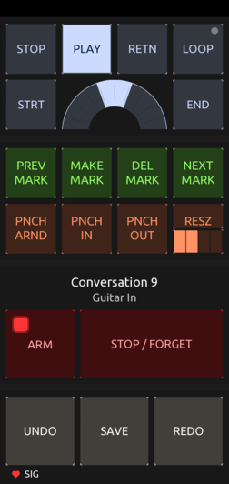

# converser
A [TouchOSC](https://hexler.net/touchosc) control surface for [Ardour](https://ardour.org/) to aid in recording.

## Why?

While recording you often find yourself out of reach from your DAW, especially when you position yourself for more optimal accoustics in mic'd situations. Constantly getting up to issue commands at your workstation can quickly kill your focus on the music and a quality performance.

The _converser_ is a simple control surface you can use on a phone or tablet at your place of performance to help you lay down a track, review it, mark locations at which you would like to punch over, adjust the punch size / in / out, and have another go at it. See the workflow below for more.

## Controls

From top to bottom,
* __STOP__ playback
* __PLAY__ from the playhead
* __RETN__, toggle auto return
* __LOOP__, play and loop the loop range
* __STRT__, goto start marker
* __JOG__ forward or backward
* __END__, goto end marker
* __PREV MARK__, goto the previous mark
* __MAKE MARK__, add a marker at playhead
* __DEL MARK__, delete the marker at playhead
* __NEXT MARK__, goto the next mark
* __PNCH ARND__, configure the punch range around the playhead. Usually this is at a marker with an encoded punch size. This functionality requires the 'punch-around' editor action script to be configured as the session's Action Script #3.
* __PNCH IN__, toggle punch in
* __PNCH OUT__, toggle punch out
* __RESZ__, while playhead is at a marker, encode the _'punch around'_ size into the marker's name. The size is specified by the 4-option radio control just below. Each option represents 1, 2, 4, and 6 bars worth of time both left and right of the playhead. Thus options 1-4 result in punch sizes of 2, 4, 8, and 12 bars worth of time respectively.
* __[Session Name]__
* __[Selected Track Name]__, or 'Master' when none selected. The track you wish to record to should be selected prior to beginning, as the _converser_ does not support track selection at this time.
* __ARM__, there are two toggles to arm recording. The smaller button toggles master recording, while the larger toggles the selected track recording.
* __STOP / FORGET__, stop the in-process recording and remove the related recorded track material.
* __UNDO__ the last action
* __SAVE__ the session
* __REDO__ the last undo
* _heartbeat_, shows your control surface is connected to the Ardour DAW. If the heartbeat no longer shows or no longer blinks, something has gone awry. Exit out of _control surface view_, then restart view mode.
* _SIG_, shows when a signal is detected via playback, or when your track is armed, shows interface input signal.

## Requirements and Configuration

### Ardour 6.9.0

Open Sound Control surfaces must be enabled through the preferences.
> __Edit > Preferences > Control Surfaces__
* Choose and Enable "Open Sound Control (OSC)"
* Select "Show Protocol Settings"
  - OSC Setup:
    + Port Mode: Manual
    + Reply Manual Port: 8000 (or whatever you like)
    + Preset: Load Last Session
  - Default Strip Types:
    +  [x] Audio Tracks
    +  [x] Control Masters
    +  [x] Selected Tracks
  - Default Feedback (feedback value shoud be 8735 or more)
    +  [x] Strip Buttons
    +  [x] Strip Controls
    +  [x] Use SSID as Path Extension
    +  [x] Use Heartbeat
    +  [x] Master Section
    +  [x] Signal Present
    +  [x] Extra Select Only Feedback
 
 The Punch-Around Lua script must be configured via the script manager.
 > __Edit > Lua Scripts > Script Manager__
 * Action Scripts
   - Select "Action 3"
   - Press "Add/Set"
   - Choose the 'Punch-Around' script. Be sure to place it in Ardour's configured script directory.

You'll find it useful to create a template session with all these settings in place, along with your specific interface, track, and plugin stack already setup. Be sure to adjust the nudge clock to something acceptable for jogging forward / backward.

### TouchOSC 1.1.1.136

The control surface is setup to talk to Ardour via OSC connection 1.
> Connections > OSC
* Enable Connection 1 over UDP
  - Host: Set to Ardour's host IP
  - Send Port: Any
  - Receive Port: 8000, or match to whatever you set in Ardour's reply port
  - Zeroconf: Disabled

## Workflow

Soon..
